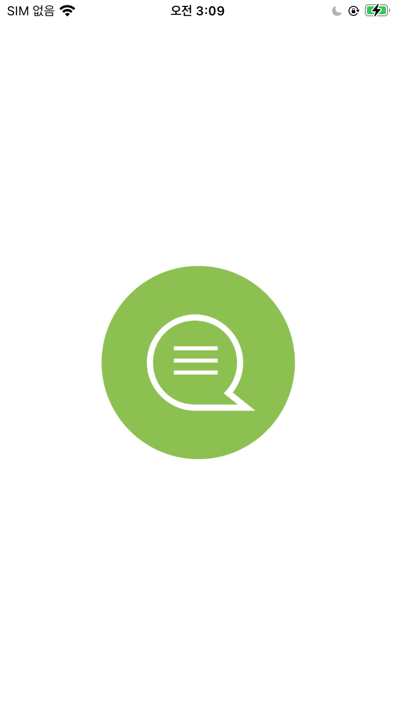
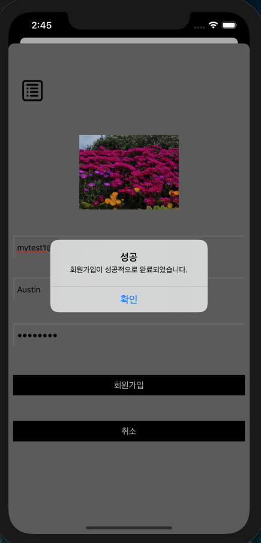
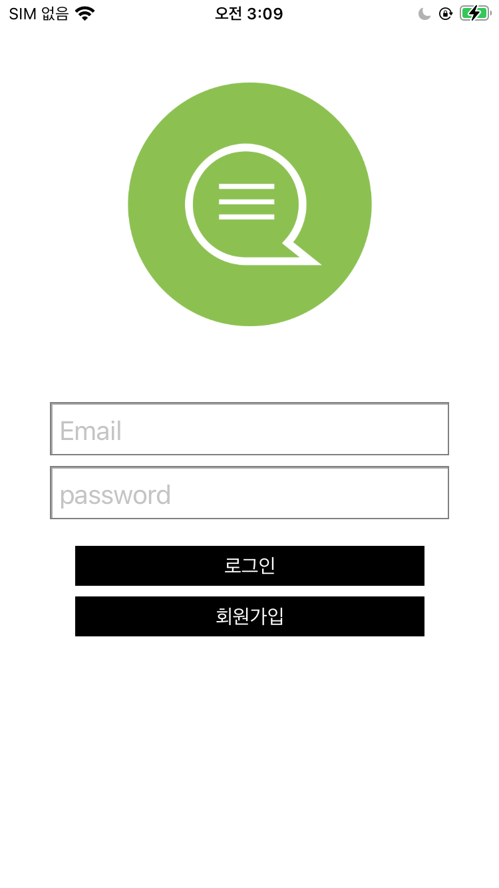
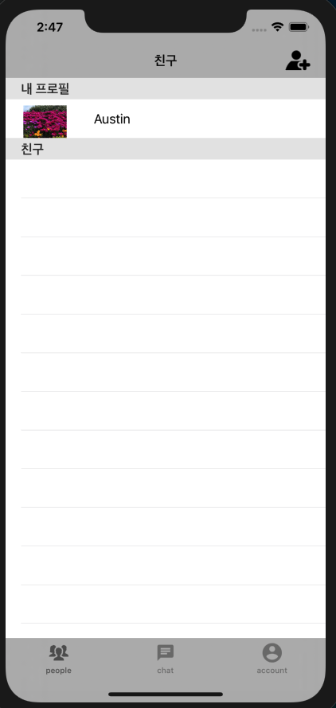

## [구글 파이어 베이스와 MVVM 패턴을 이용한 카카오톡 클론 앱 프로젝트]
- 1.진행 기간 : 2020.04.05 ~ 2020.06
- 2.주요 내용 : MVVM 패턴과 구글 API를 공부하면서 카카오톡을 따라 만드는 클론 앱 프로젝트입니다. 
- 3.본인이 공헌한 점: 개인 프로젝트로서 앱 설계부터 구현까지 모두 스스로 개발하고 있고, MVVM 패턴 사용할 때, RxSwift가 아닌 Swift만을 이용하여 MVVM 패턴을 구현하였습니다.

- 4.사용한 Skill 또는 지식: MVVM 패턴, Swift를 사용, 서버로는 구글 파이어 베이스의 realtime Database, Auth 등을 이용.
- 5.결과/성과 : MVVM 패턴의 이해와 iOS 앱 개발 실력 향상에 도움이 되었습니다.

## ■ 앱 실행 이미지

<figure> 

<figcaption>⬅︎ 런치 이미지</figcaption>
</figure>
  <figure>

<figcaption>⬅︎ 회원가입 </figcaption>
    </figure>
        <figure>

<figcaption>⬅︎ 로그인 화면</figcaption>
        </figure>
      <figure>

<figcaption>⬅︎ 채팅 메인</figcaption>
    </figure>
     <figure>

<figcaption>⬅︎ 친구 요청</figcaption>
    </figure>

